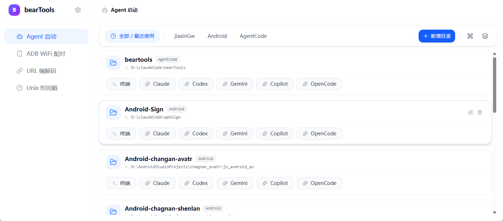

# bearTools 🐻✨

一个为开发者而生的 **跨平台桌面工具箱**。基于 Tauri + React，专注**多工具、多标签、状态保活**的高效工作流。开箱即用，也便于扩展。

---

## 🌟 亮点一览
- 🧰 多工具集合：常用开发小工具集中在一个应用里
- 🗂️ 多标签工作区：同一工具可开启多个实例，互不干扰
- 🧠 状态保活：切换工具/标签不会丢输入、滚动、结果
- ⚡ 原生级体验：桌面端性能 + 前端迭代效率兼得
- 🧩 易扩展：新增工具只需配置注册 + 组件实现

---

## 🧭 核心架构（简述）
应用采用“**工具上下文 + 多标签实例**”架构：
- 左侧是工具入口（可拖拽排序）
- 右侧是工具工作区（多标签实例 + 状态保活）
- 隐藏的工具实例不会卸载，仅通过 `display`/`hidden` 控制可见性

---

## 🧪 已内置工具
- 📶 **ADB WiFi 配对**：设备检测、配对、连接与结果复核
- 🔗 **URL 编解码**
- 🧾 **JSON 格式化**：支持去除/增加转义、格式化展示、树结构查看、全展开/全折叠、校验错误定位
- ⏱️ **Unix 时间戳**：秒/毫秒转换、日期时间互转
- 🤖 **Agent 启动器**：目录/命令管理，一键打开终端执行



---

## 🚀 快速开始
```bash
# 安装依赖
npm install

# 桌面端开发
npm run tauri dev

# 打包发布
npm run tauri build
```
